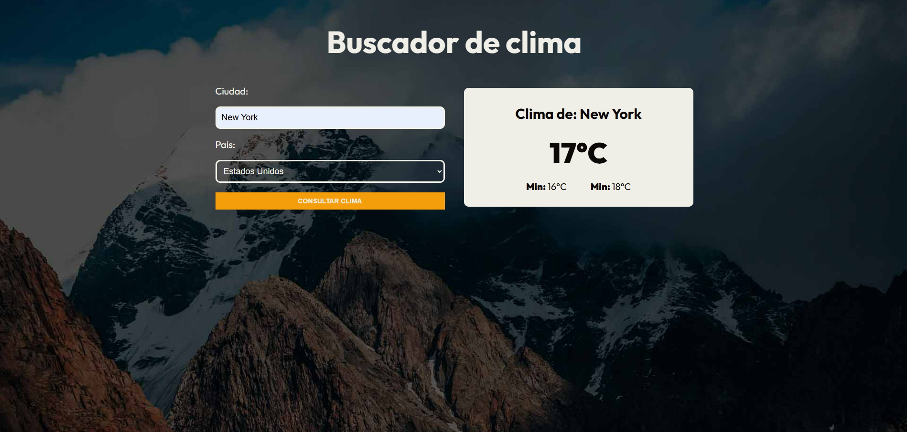

# 🌦️ Clima API Consulta

Consulta el clima actual de cualquier ciudad ingresando el nombre de la ciudad y el país. La aplicación muestra el estado actual del tiempo de manera clara y precisa.

🔗 [Live Demo](https://clima-api-consulta.netlify.app/)

---
## 🌅 Vista previa



## 📚 Tecnologías utilizadas

- **React**: Librería principal para la creación de la interfaz de usuario.  
- **TypeScript**: Tipado estático para mejorar la robustez y el mantenimiento del código.  
- **Axios**: Cliente HTTP para realizar llamadas a la API de clima.  
- **Custom Hook**: Para centralizar la lógica de consulta del clima.  
- **useState y useMemo**: Gestión y optimización del estado.  
- **Type Guards**, **Zod** y **Valibot**: Validación y manejo seguro de la respuesta de la API.  
- **API KEY en Variables de Entorno**: Buenas prácticas para la gestión segura de claves.  

---

## ⚙️ Funcionalidades

| Funcionalidad                                | Descripción                                                                 |
|----------------------------------------------|-----------------------------------------------------------------------------|
| 🌍 Consulta de Clima                          | Permite ingresar la ciudad y el país para obtener el clima actual.            |
| 📊 Visualización clara                        | Muestra el estado del clima de manera organizada y simple.                   |
| 🔑 Seguridad de la API KEY                    | Almacenamiento seguro de la clave como variable de entorno.                  |
| 🛠️ Validación de datos                        | Uso de Type Guards, Zod y Valibot para asegurar respuestas consistentes.      |
| 🚀 Optimización del rendimiento               | Evita llamadas redundantes a la API usando useMemo.                          |

---

## 🚀 Instalación y uso

1. Clona el repositorio:

   ```bash
   git clone https://github.com/tuusuario/clima-api-consulta.git
   cd clima-api-consulta
   ```
2. Instala las dependencias:
   ```bash
   npm install
3. Crea un archivo .env en la raíz del proyecto y añade tu API KEY:
   ```bash
     REACT_APP_API_KEY=tu_api_key
    ```
4. Inicia el servidor de desarrollo:
   ```bash
     npm run dev
    ```
5. Abre tu navegador y accede a:
   ```bash
     http://localhost:5173
    ```
   
## 🌟 Lecciones aprendidas
Configuración y uso de variables de entorno en React para manejar claves de API de manera segura.

Creación y uso de Custom Hooks para modularizar la lógica de consulta de datos.

Validación efectiva de datos usando Type Guards, Zod y Valibot para garantizar la integridad de la información.

Implementación de técnicas para mejorar el rendimiento en la renderización de componentes con useMemo.


---

# 🌦️ Weather API Query

Check the current weather of any city by entering the city name and country. The app clearly and accurately displays the current weather status.

🔗 [Live Demo](https://clima-api-consulta.netlify.app/)

---

## 🌅 Preview


---

## 📚 Technologies Used

- **React**: Main library for building the user interface.  
- **TypeScript**: Static typing to enhance code robustness and maintainability.  
- **Axios**: HTTP client for making weather API calls.  
- **Custom Hook**: To centralize the weather query logic.  
- **useState and useMemo**: State management and performance optimization.  
- **Type Guards**, **Zod**, and **Valibot**: Safe validation and handling of API responses.  
- **API Key in Environment Variables**: Best practices for secure key management.  

---

## ⚙️ Features

| Feature                                    | Description                                                              |
|--------------------------------------------|--------------------------------------------------------------------------|
| 🌍 Weather Query                           | Enter the city and country to get the current weather.                    |
| 📊 Clear Visualization                     | Displays weather status in an organized and simple way.                   |
| 🔑 API Key Security                        | Secure storage of the API key as an environment variable.                 |
| 🛠️ Data Validation                        | Uses Type Guards, Zod, and Valibot to ensure consistent responses.         |
| 🚀 Performance Optimization                | Avoids redundant API calls using useMemo.                                 |

---

## 🚀 Installation and Usage

1. Clone the repository:

   ```bash
   git clone https://github.com/yourusername/weather-api-query.git
   cd weather-api-query
2. Install dependencies:
   ```bash
   npm install
3. Create a .env file at the root of the project and add your API KEY:
   ```bash
     REACT_APP_API_KEY=tu_api_key
    ```
4. Start the development server:
   ```bash
     npm run dev
    ```
5. Open your browser and go to:
   ```bash
     http://localhost:5173
    ```
## 🌟 Lessons Learned
Configuring and using environment variables in React for secure API key management.

Creating and utilizing Custom Hooks to modularize query logic.

Effective data validation using Type Guards, Zod, and Valibot to ensure data integrity.

Implementing performance optimization techniques with useMemo for efficient rendering.
